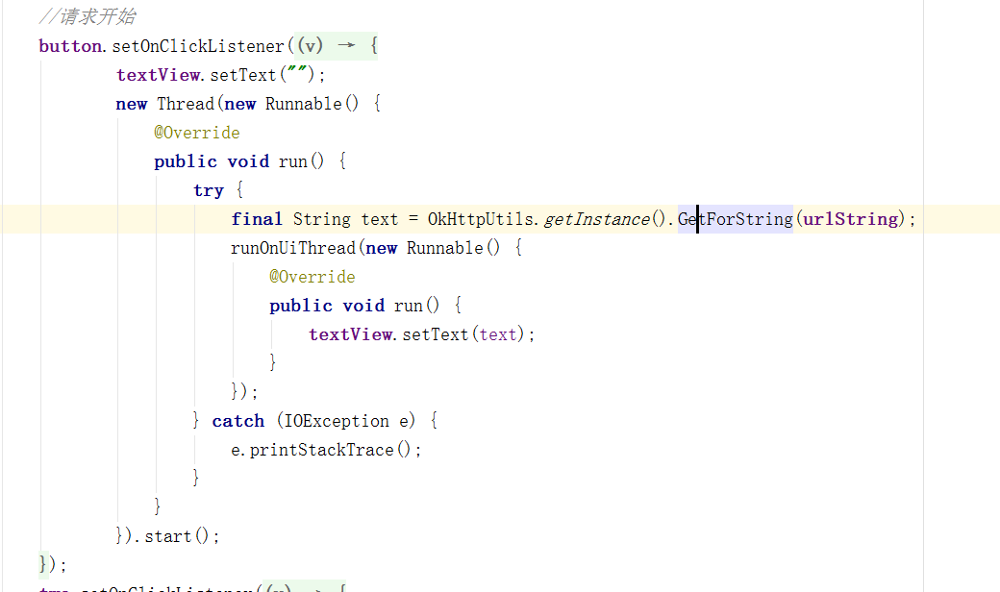
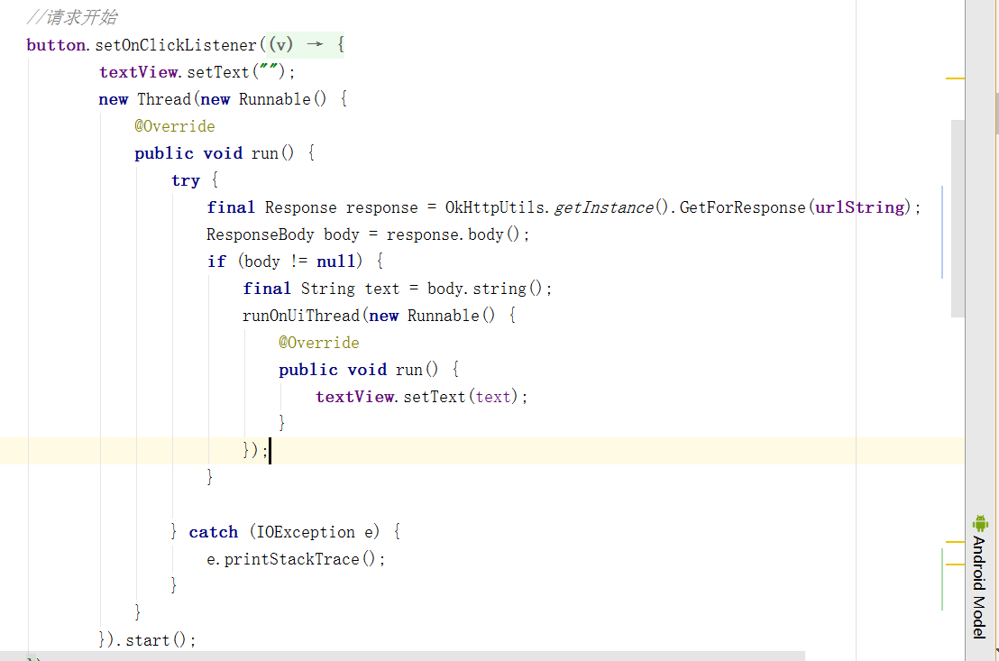
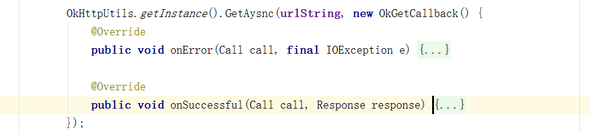
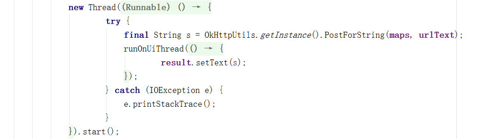
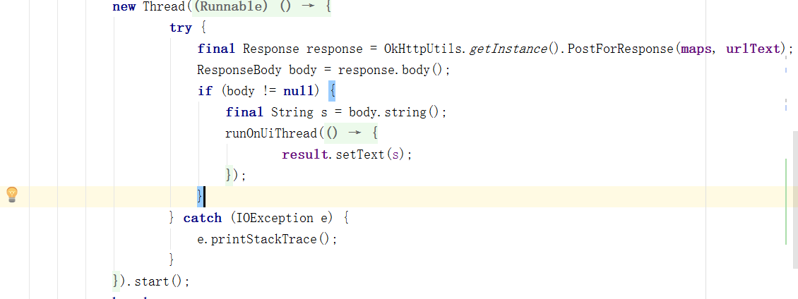
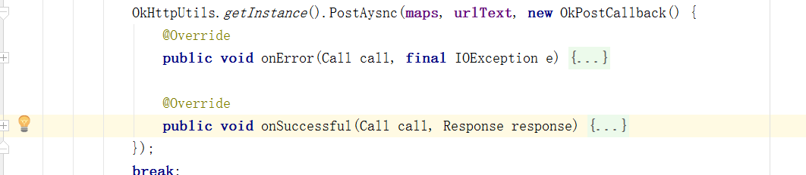

# OkHttpUtil 说明文档

###### Tips:现在只是第一版本，狗屎最初版，啊哈哈哈哈哈

> 使用OkHttp的依赖：compile 'com.squareup.okhttp3:okhttp:3.10.0'

### 1.Get请求

* 此处封装的Get请求有同步和异步两种；

  * 同步Get请求，需要在子线程调用，一下两种方法：

    * `GetForString`：传入url地址，返回的是string字符串

      ​

      

      ​

    * `GetForResponse`：，传入url地址，返回的是Response对象，操作起来更为灵活一些。

      ​

      

      ​

  * 异步Get请求，参数有 `url` 和 `OkGetCallback`，不需要开子线程，在回调结果处进行相应的处理便好，此处返回Response对象：

    ​	

### 2.Post请求

* 此处封装的Post请求有同步和异步两种，都有Map对象，添加key-value参数去上传需要的数据：

  `private Map<String, Object> maps = new HashMap<>();`

  * 同步Post请求，需要在子线程调用，分为以下两种：

    * `PostForString`，传入  `map`   和  `url`   返回string：

      

    * `PostForResponse`，传入  `map`   和  `url`   返回Response对象：

      

  * 异步Post请求，不需要在子线程中调用，传入  `map`  、 `url`  和 `OkPostCallback`  返回Response对象：

    